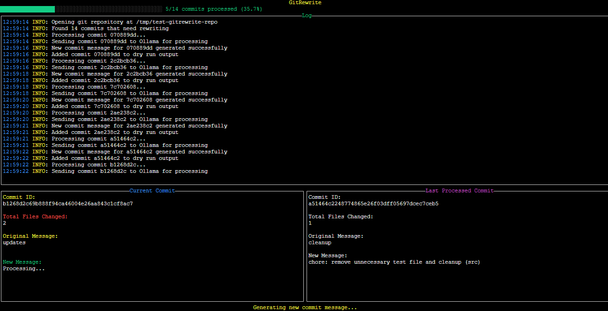

# GitRewrite 🪄

<div align="center">

[](https://goreportcard.com/report/github.com/MrLemur/gitrewrite)
[](https://opensource.org/licenses/MIT)
[](https://github.com/MrLemur/gitrewrite/releases)

**Intelligently rewrite your Git history with AI-powered commit messages.**



</div>

- [ALPHA SOFTWARE DISCLAIMER](#alpha-software-disclaimer)
- [Overview](#overview)
- [Features](#features)
- [Usage](#usage)
  - [Basic Usage](#basic-usage)
  - [Options](#options)
  - [Workflow Example](#workflow-example)
- [Requirements](#requirements)
- [Installation](#installation)
  - [Using Go](#using-go)
  - [From Source](#from-source)
  - [Ollama Setup](#ollama-setup)
  - [Recommended: Custom Ollama Modelfile](#recommended-custom-ollama-modelfile-with-increased-context)
- [Examples for Advanced Scenarios](#examples-for-advanced-scenarios)
- [Motivation](#motivation)
- [Cautions and FAQ](#cautions-and-faq)
  - [Rewriting History Implications](#rewriting-history-implications)
  - [Known Limitations (Alpha)](#known-limitations-alpha)
  - [Common Questions](#common-questions)
- [Development](#development)

## ALPHA SOFTWARE DISCLAIMER

**GitRewrite is currently in ALPHA stage of development.**

- This software is experimental and may contain bugs or unexpected behavior
- It is NOT recommended for use in production environments or with critical repositories
- Always create a backup of your repository before using GitRewrite
- Git history rewriting is inherently risky - proceed with caution
- Features and command-line interface may change without notice
- Use at your own risk

## Overview

GitRewrite transforms your repository's history by converting cryptic or minimal commit messages into meaningful, structured, conventional commits. Using AI, it analyzes each commit's code changes and creates descriptive messages that explain _what_ changed and _why_.

**Before GitRewrite:**

```
fix stuff
```

**After GitRewrite:**

```
fix: resolve race condition in database connection pooling (database)
chore: update Docker image to v21.3.1 (infrastructure)
```

## Features

- **AI-Powered Message Generation**: Analyzes diffs to create meaningful, context-aware commit messages
- **Conventional Commits Format**: Structures messages with type, description, and component
- **Interactive TUI**: Beautiful terminal interface with real-time progress tracking
- **Dry Run Mode**: Preview changes before applying them
- **Batch Rewrite**: Process and rewrite multiple commits at once
- **Filters**: Target only commits with minimal or unclear messages
- **Repository Safety**: Careful validation prevents accidental history corruption

## Usage

### Basic Usage

```bash
gitrewrite -repo=/path/to/repository
```

### Options

```
  -repo string
        Path to the git repository
  -max-length int
        Maximum length of commit messages to consider for rewriting (default: 10)
  -model string
        Ollama model to use for rewriting (default: "qwen2.5:14b")
  -temperature float
        Temperature for model generation (default: 0.1)
  -max-diff int
        Maximum length of diff to send to the model (default: 2048)
  -dry-run
        Generate new commit messages but don't apply them
  -output string
        Custom path for dry run output file (default: repo-name-rewrite-changes.json)
  -apply-changes string
        Path to JSON file with commit rewrite changes to apply directly without using Ollama
  -exclude string
        Regex pattern to exclude matching files from diff processing
  -max-files int
        Maximum number of files in a commit before handling differently (default: 200)
  -summarize-oversized
        Generate a one-line summary for commits with too many files instead of skipping them
  -debug-log string
        Path to output debug log file
  -output-repo string
        Name of the output repository (default: <original-repo-name>-rewritten)
```

### Workflow Example

1. **IMPORTANT**: Before running GitRewrite, create a backup of your repository and ensure you're on the default branch:

   ```bash
   cp -r /path/to/repo /path/to/repo-backup
   cd /path/to/repo
   git checkout main  # or your default branch (master, develop, etc.)
   ```

2. Run GitRewrite in dry-run mode first to preview changes without applying them:
   ```bash
   gitrewrite -repo=/path/to/repo -dry-run
   ```
   This will generate a JSON file (default: repo-name-rewrite-changes.json) with the proposed commit message changes.
3. Review the generated JSON file and make any desired edits.

4. Apply the changes from the JSON file:

   ```bash
   gitrewrite -repo=/path/to/repo -apply-changes=path/to/changes.json
   ```

   A confirmation dialog will appear before applying the changes.

5. For direct rewriting (not recommended for important repositories during alpha):

   ```bash
   gitrewrite -repo=/path/to/repo
   ```

   A confirmation dialog will appear:

   ```
   WARNING: This process is irreversible and will modify your git history.

   'No' is selected by default. Use Tab to select 'Yes' if you want to proceed.
   ```

6. GitRewrite creates a new repository with rewritten history:

   ```
   New repository located at /path/to/your-repo-rewritten
   ```

   The new repository will be created as a sibling directory to your original repository with the same files, branches, and remotes, but with improved commit messages.

7. To use this new repository as your main repository, you can force push it to remote:
   ```bash
   cd /path/to/your-repo-rewritten
   git push --force origin main  # or your default branch
   ```
   Note: Force pushing rewrites history on the remote repository and affects all collaborators.

## Requirements

- Go 1.23.4+
- Git
- [Ollama](https://ollama.ai/) with a large language model installed (default: qwen2.5:14b)

## Installation

### Using Go

```bash
go install github.com/MrLemur/gitrewrite/cmd/gitrewrite@latest
```

### From Source

```bash
git clone https://github.com/MrLemur/gitrewrite.git
cd gitrewrite
make build
```

### Ollama Setup

1. Install Ollama from [ollama.ai](https://ollama.ai)
2. Pull the recommended model:
   ```bash
   ollama pull qwen2.5:14b
   ```
3. Ensure Ollama is running before using GitRewrite

### Recommended: Custom Ollama Modelfile with Increased Context

For repositories with larger commits, it's highly recommended to create a custom Ollama model with increased context length. This improves the AI's ability to analyze code changes for better commit message generation.

1. Create a file named `Modelfile` with the following content:

   ```
   FROM qwen2.5:14b
   PARAMETER context_length 32768
   ```

2. Build the custom model:

   ```bash
   ollama create gitrewrite-qwen -f ./Modelfile
   ```

3. Use your custom model with GitRewrite:
   ```bash
   gitrewrite -repo=/path/to/repo -model=gitrewrite-qwen
   ```

Note: Increasing the context length requires more RAM and VRAM. Adjust the `context_length` value based on your system capabilities (16K, 32K, etc.).

## Examples for Advanced Scenarios

**Handling Repositories with Many Files Per Commit**

For repositories with a large number of files per commit:

```bash
gitrewrite -repo=/path/to/repo -max-files=300
```

This increases the limit of files processed per commit before the commit is considered "oversized".

**Generate Summaries for Oversized Commits**

Instead of skipping commits with too many files, generate a simplified message:

```bash
gitrewrite -repo=/path/to/repo -summarize-oversized
```

**Excluding Specific Paths from Analysis**

To ignore certain paths using regex patterns (like generated files or dependencies):

```bash
gitrewrite -repo=/path/to/repo -exclude="node_modules|dist|vendor|.*\.generated\.go"
```

**Custom Output Repository Name**

Specify a custom name for the new repository:

```bash
gitrewrite -repo=/path/to/repo -output-repo="my-improved-repo"
```

**Enable Debug Logging**

For troubleshooting or detailed analysis:

```bash
gitrewrite -repo=/path/to/repo -debug-log="./debug.log"
```

## Motivation

Every developer has encountered (or created) repositories with unclear commit histories. GitRewrite was born from the frustration of maintaining a GitOps repository where many small changes accumulated over time with minimal or unhelpful commit messages.

When you're debugging an issue or trying to understand why a change was made months ago, commit messages like "update config" or "fix bug" are nearly useless. GitRewrite transforms these into a clean, structured history that documents your codebase's evolution properly.

By enforcing [Conventional Commits](https://www.conventionalcommits.org/) standards and detecting affected components, GitRewrite makes your Git history into a powerful documentation tool rather than a cryptic timeline.

## Cautions and FAQ

### Rewriting History Implications

- **ALWAYS CREATE A BACKUP before using this tool** - this cannot be emphasized enough
- During alpha development, unexpected bugs may cause repository corruption
- Consider testing on a clone or fork of your repository first
- GitRewrite must be run on the default branch of your repository (typically main or master)
- The tool automatically verifies you're on the default branch before proceeding
- Rewriting history changes commit hashes, which can cause issues for collaborators
- For shared repositories, communicate with your team before using this tool
- After force pushing rewritten history, all collaborators must reset their local repositories
- Collaborators should follow this procedure after you've force pushed:
  ```bash
  git fetch origin
  git checkout main  # or your default branch
  git reset --hard origin/main
  ```
- Failing to reset local repositories after history rewriting can lead to merge conflicts and duplicate commits
- Protected branches on GitHub, GitLab, or other platforms may block force pushes
- If you have active branches based on the old history, they will need to be rebased onto the new history

### Known Limitations (Alpha)

- May not handle merge commits correctly in all situations
- Large repositories with complex histories might cause unexpected behavior
- Performance issues might occur with very large commits or diffs
- Repositories with binary files or non-text content may not be analyzed correctly
- Commits with more files than the `-max-files` limit will be skipped unless `-summarize-oversized` is used
- The program works best on repositories with a clean, linear history
- Certain regex patterns in the `-exclude` flag might impact performance on large repositories

### Common Questions

**Q: How long will it take to process my repository?**  
A: Processing time depends on repository size, commit count, and your machine's specs. A rough estimate is 2-5 seconds per commit being rewritten.

**Q: Will this affect branches?**  
A: Yes. Rewriting commits will change their hashes, which can affect branches that build upon those commits.

**Q: What if I don't like some of the generated messages?**  
A: Use the dry-run mode to preview changes, edit the JSON file as needed, then apply with `-apply-changes`.

**Q: Can I process only specific commits?**  
A: Currently, the tool processes all commits with messages shorter than the `-max-length` threshold. You can use the `-exclude` pattern to skip files in certain paths, which may indirectly filter some commits.

**Q: What happens with commits that have too many changed files?**  
A: By default, commits with more than 200 files (configurable with `-max-files`) are skipped. Enable `-summarize-oversized` to generate simplified messages for these commits instead of skipping them.

**Q: Can I customize the name of the output repository?**  
A: Yes, use the `-output-repo` flag to specify a custom name for the new repository.

**Q: What should I do if I encounter a bug?**  
A: Please report it on our GitHub issues page with detailed steps to reproduce.

## Development

```bash
# Clone the repository
git clone https://github.com/MrLemur/gitrewrite.git

# Install dependencies
cd gitrewrite
go mod tidy

# Run tests
make test

# Build
make build

# Run locally with dry-run for safety during development
./bin/gitrewrite -repo=/path/to/test/repo -dry-run
```
